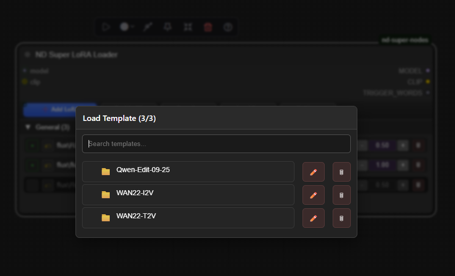

# ND Super Nodes

A suite of modern, easy-to-use custom nodes for ComfyUI, including enhanced LoRA loading and powerful UI enhancements for file selection.

## 🌟 Features

- Add multiple LoRAs quickly (single-click or multi-select)
- Per-LoRA enable and strengths (Model/CLIP)
- Trigger words (auto or manual)
- Templates: save, load, rename, delete
- Optional tags with collapsible groups
- Duplicate detection (prevents adding the same LoRA twice)

## 📸 Screenshots


-  – Expanded node with inline strength controls and tag headers.
-  – Lightning overlay with folder chips, search, and multi-select.
-  – Save, load, rename, and delete templates from the overlay dialog.

## ⚡ ND Super Selector Enhancements

Enhance standard ComfyUI nodes with advanced file picker overlays:

- **Enhanced Nodes**: CheckpointLoader, VAELoader, LoraLoader, UNETLoader, CLIPLoader, ControlNetLoader, UpscaleModelLoader, and GGUF variants
- **Visual Indicators**: Golden-bordered overlay widgets with lightning icon (⚡) for easy identification
- **File Picker**: Click the overlay to open an advanced file browser with folder navigation and search
- **Per-Node Toggle**: Enable/disable enhancements via right-click menu on individual nodes
- **Persistence**: Settings and selections persist across workflow saves/loads

To enable: Right-click on a supported node → "⚡ Enable ND Super Selector"

## Install

### Option 1: Compiled Release (Recommended for Users)

For a lightweight install without source code:

1. Go to [Releases](https://github.com/HenkDz/nd-super-nodes/releases) and download the latest ZIP (e.g., `nd-super-nodes-v1.0.0.zip`).
2. Extract to your ComfyUI custom nodes folder:
   - Windows: `ComfyUI\custom_nodes`
   - macOS/Linux: `ComfyUI/custom_nodes`
3. Restart ComfyUI.

### Option 2: Full Repo (For Developers/Contributors)

To get the full source code and contribute:

1. Go to your ComfyUI custom nodes folder:
   - Windows: `ComfyUI\custom_nodes`
   - macOS/Linux: `ComfyUI/custom_nodes`
2. Clone this repo:

```bash
git clone https://github.com/HenkDz/nd-super-nodes.git nd-super-nodes
```

1. Restart ComfyUI

## 🔁 Update

We ship cross-platform scripts so you can refresh without pulling the full repo:

- **Windows (PowerShell):** run `./update.ps1` inside your `nd-super-nodes` folder.
- **Linux/macOS (bash):** run `./update.sh` (optionally pass `--prerelease` or `--force`).

Behind the scenes the scripts

- check the current version via `version.json`
- download the latest lightweight release from GitHub
- create a timestamped backup in `backups/`
- replace the runtime files with the fresh build

You can also trigger an in-app check from ComfyUI via the “Check ND Super Nodes Updates” command or wait for the automatic toast that appears once per day.

## Use

1) Add node: search "Super LoRA Loader"
2) Connect MODEL (required) and CLIP (optional)
3) Click "➕ Add LoRA"; select one or use Multi-select to add many
4) Adjust strengths/trigger words; save a template if you like

Tips:

- In the overlay, use folder/subfolder chips to narrow large lists
- The first selection updates the clicked row; extra selections append

More details: see `docs/development.md`

License: MIT
